# CountSE — Runtime module flow map (canonical: cfg_fsc147_val.py)

Built from `forward` bodies (not `__init__` wiring). Scope: training tree (`models/`, `engine.py`). Shapes use `bs` = batch, `H_i/W_i` = per-level spatial dims (stride 8/16/32/64). See `analysis/canonical-config.md` for where every scalar comes from.

```mermaid
flowchart LR
    subgraph INPUTS
        IMG["image"]
        TXT["caption"]
    end

    subgraph GTXT["GroundingDINO.forward  (container)"]
        direction TB
        TK["tokenizer(caption)"] --> |"input_ids one_hot_token [bs, L] remax 256"| BERT
        BERT[["bert = BertModelWarper"]] --> |"last_hidden_state [bs, 195, 768]"| FMAP["feat_map Linear(768,256)"]
        FMAP --> |"encoded_text [bs, 195, 256]"| TD["text_dict"]

        BACKBONE[["backbone = Joiner (swin_B_384_22k + PositionEmbeddingSineHW)"]] --> |"features [bs,256,H8,W8],[bs,512,H16,W16],[bs,1024,H32,W32] + poss"| IPROJ["input_proj (3x Conv1x1 + 1x Conv3x3-s2, +GroupNorm)"]
        IPROJ --> |"srcs[0..3] + masks[0..3], each [bs,256,H,W]"| SES
        IPROJ --> |"srcs (all 4 levels) [bs,256,H,W]"| TRFM

        TD --> |"encoded_text / token_mask / pos_ids / self_attn_mask"| SES
        SES["ExemplarSelector  (SES + CEF)"] --> |"exemplar_tokens [bs,4,256]  (one mean feature per scale)"| ADDEX["add_exemplar_tokens"]
        TD --> |"text_dict"| ADDEX
        ADDEX --> |"text_dict w/ +4 exemplar tokens  [bs, ~199, 256]"| TRFM
    end

    TRFM["transformer = Transformer"] --> |"memory [bs, sum(hw), 256] + memory_text [bs, n_text, 256]"| DEC
    TD --> |"encoded_text→memory_text for decoder"| DEC

    subgraph ENC["Transformer.encoder = TransformerEncoder"]
        E0["DeformableTransformerEncoderLayer x6 (MSDeformAttn + FFN)"] 
        E1["text_enhance_layer (TransformerEncoderLayer x6)"]
        E2["feature_fusion_layer (BiAttentionBlock x6)"]
    end

    subgraph DEC["Transformer.decoder = TransformerDecoder"]
        DLAYER["DeformableTransformerDecoderLayer x6 (self MHA + text MHA + MSDeformAttn cross + FFN)"]
        RP["ref_point_head MLP(512,256,256,2)"]
    end

    SES --> |"srcs (4 levels)"| E0
    E0 --> |"memory [bs, sum(hw), 256]"| E2
    E1 --> |"memory_text (enhanced)"| E2
    E2 --> |"memory, memory_text"| TRFM
    DLAYER --> |"hs [6, bs, 900, 256] + references [7, bs, 900, 4]"| HDR

    subgraph HDR["heads"]
        CLS["class_embed = ContrastiveEmbed x6"]
        BOX["bbox_embed = MLP(256,256,4,3) x6"]
    end

    CLS --> |"pred_logits [bs, 900, max_text_len]  (last layer) + aux"| OUT["out"]
    BOX --> |"pred_boxes [bs, 900, 4]  (cxcywh, sigmoid)"| OUT

    OUT --> |"pred_logits + pred_boxes + one_hot token masks"| CRIT["SetCriterion"]
    CRIT --> |"loss_ce (focal, w=5) + loss_bbox (L1, w=1); giou w=0"| LOSS["total loss"]
```

## Legend

| Component                           | Code-level what                                                                                | Role / why present                                                                                                                                                                          | Output semantics                                                                                |
| ----------------------------------- | ---------------------------------------------------------------------------------------------- | ------------------------------------------------------------------------------------------------------------------------------------------------------------------------------------------- | ----------------------------------------------------------------------------------------------- |
| `tokenizer` + `bert`                | `get_tokenlizer`/`bertwarper`. BERT-base from local dir `./pretrained_ckpts/bert-base-uncased` | Frozen text encoder (frozen via `freeze_keywords=['bert']`)                                                                                                                                 | `last_hidden_state [bs,195,768]` → text token features                                          |
| `feat_map`                          | `Linear(768,256)`                                                                              | project BERT dim → model dim                                                                                                                                                                | `encoded_text [bs,195,256]`                                                                     |
| `backbone` (`Joiner`)               | `swin_B_384_22k` + `PositionEmbeddingSineHW`                                                   | Frozen Swin vision backbone + sine pos encodings                                                                                                                                            | multi-scale features `[256,512,1024]` at strides 8/16/32 + `pos` per level (metadata, not loss) |
| `input_proj`                        | 3× `Conv1×1+GN` + 1× `Conv3×3-s2+GN`                                                           | project backbone channels →256; 4th level downsamples 1024→256 (extra `num_feature_levels=4`)                                                                                               | `srcs[0..3]` all `[bs,256,H,W]`                                                                 |
| `ExemplarSelector` (SES+CEF)        | `groundingdino.py:64-210`                                                                      | **CountSE core**: per-scale text-similarity top-k (SES, `topk=15`) → spectral clustering (CEF, sklearn on CPU) → allocate `max_added_num=18` across 4 scales by score, mean-pool each scale | `exemplar_tokens [bs,4,256]` — soft exemplars (no params added)                                 |
| `add_exemplar_tokens`               | `groundingdino.py:436`                                                                         | splice 4 exemplar tokens into text_dict at the label's token span (token id 1008)                                                                                                           | text_dict with `~199` text tokens                                                               |
| `Transformer.encoder`               | 6× deformable layers + 6× text-enhance + 6× BiAttention fusion                                 | deformable image enc + text-only enc + vision↔language fusion                                                                                                                               | `memory [bs,sum(hw),256]`, `memory_text`                                                        |
| `Transformer.decoder`               | 6× layers (self MHA, text MHA, MSDeform cross, FFN) + `ref_point_head`                         | DETR-style decoding; conditional query pos from sine ref points                                                                                                                             | `hs [6,bs,900,256]`, `references [7,bs,900,4]`                                                  |
| `class_embed` (`ContrastiveEmbed`)  | dot product query vs text tokens                                                               | produce per-token logits                                                                                                                                                                    | `pred_logits [bs,900,max_text_len]` — feeds loss                                                |
| `bbox_embed` (`MLP(256,256,4,3)`)   | box offset regression                                                                          | locate objects                                                                                                                                                                              | `pred_boxes [bs,900,4]` cxcywh sigmoid                                                          |
| `SetCriterion` + `HungarianMatcher` | `groundingdino.py:667`, `matcher.py:25`                                                        | bipartite matching + focal CE + L1 loss                                                                                                                                                     | `loss_ce` weight 5, `loss_bbox` weight 1                                                        |

## Cross-boundary notes

- **exemplar_tokens fan out is single-use**: produced by `ExemplarSelector` and consumed only by `add_exemplar_tokens` (no second consumer). The `feature_map_proj/encoder/pos_embed` CountGD blocks are constructed but **not called in this training `forward`** (leftover from CountGD exemplar-crop path; `roi_align` imported but unused).
- **`label_dict` vs `text_dict`** are two different dicts: `get_label_embeddingv2(label_list)` (used only by `ExemplarSelector`), vs `text_dict` (tokenizer path, used by transformer + decoder). Both carry `encoded_text`; do not conflate.
- **Two-stage `standard`**: encoder output → `gen_encoder_output_proposals` → topk 900 selected as decoder `tgt`/refpoints (`embed_init_tgt=True` overrides with learned `tgt_embed`); `refpoint_embed` learned per-query.
- **Dead loss weight**: `loss_giou` computed in `loss_boxes` but weighted by `giou_loss_coef=0.0`; interm giou also 0 (see canonical-config). `cardinality` loss entirely commented out.
- **`one_hot_token`** (`out['token']`) carries the raw tokenized caption; `SetCriterion.forward` recomputes label→token `positive_map` per sample (`create_positive_map`, `groundingdino.py:1069`) rather than reusing the one from `PostProcess`.
- **`decoder_norm`/`encoder_norm`**: `pre_norm=False` → encoder_norm is None (asserted), decoder uses `nn.LayerNorm(256)`.
- **`ContrastiveEmbed` pads** to `max_text_len=256` filling masked positions with `-inf` (`utils.py:270`); text tokens are `[bs,195]` BERT-padded length despite `max_text_len=256`.
